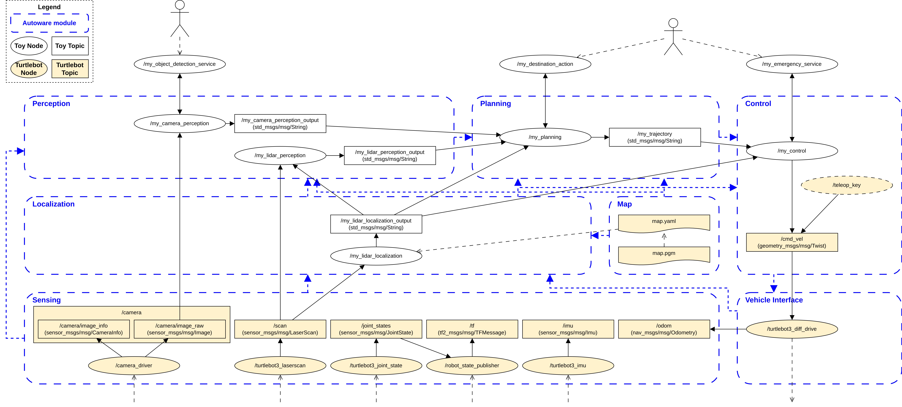
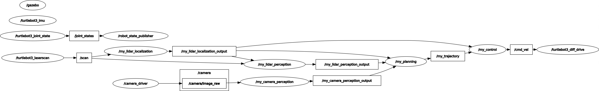

# sdi_turtlebot3_toy_app_ws

**Table of contents**
- [1. Introduction](#1-introduction)
- [2. Design](#2-design)
  - [Autoware](#autoware)
  - [Dummy ROS nodes](#dummy-ros-nodes)
  - [Simple user interface nodes](#simple-user-interface-nodes)
- [3. Workspace structure](#3-workspace-structure)
- [4. Prerequisite](#4-prerequisite)
- [5. Build](#5-build)
- [6. Run](#6-run)
  - [Quick start](#quick-start)
  - [Debug](#debug)
  - [User interface nodes](#user-interface-nodes)
- [7. Result](#7-result)
- [8. Final remarks](#8-final-remarks)
  - [Contact to authors](#contact-to-authors)


## 1. Introduction
This is a workspace of ROS2 turtlebot3 toy application for SDI project.

This toy application is designed
* to provide a reusable source skeleton of a ROS2 python application for robot mobility (e.g., turtlebot3), 
* to show blueprints of robot mobility software based on the [Autoware project](https://autoware.org/),
* to facilliate study about the concept of ROS2 and Autoware, and
* last but not least, to provide a working dummy mobility application for collaboration between research partners of SDI project.


## 2. Design


In this section, we briefly introduce three key concepts of the design of this toy application.

### Autoware
Our toy application mimics [the autonomous driving system architecture of Autoware](https://autowarefoundation.github.io/autoware-documentation/main/design/autoware-architecture/).
Autoware's autonomous driving system architecture consists of 7 core modules.
To utilize turtlebot3, we reuse the ROS2 nodes provided by turtlebot3 for the sensing, vehicle interface, and map modules.


### Dummy ROS nodes

We provide our own toy ROS2 nodes for the localization, perception, planning, and control modules.
The nodes included in the toy application are working dummy nodes that do not provide full autonomous driving functionality.
Currently, as an example, they only reference image and lidar data, and most of the outputs from each node are simple strings.
However, the flow of the nodes reflects Autoware's design and is useful for understanding the basic flow of ROS2 and Autoware in a simple manner.
This can be expanded to develop a real application based on Autoware. For more information, refer to the [Autoware design documentation](https://autowarefoundation.github.io/autoware-documentation/main/design/).


### Simple user interface nodes
An autonomous driving system can provide a user interface to the user. Therefore, we provide user interface ROS nodes (i.e., service and action clients) that express several predictable scenarios. 1) `/my_object_detection_service`: returns a list of objects recognized by the robot to the user, 2) `/my_destination_action`: user requests a destination they want to go to, 3) `/my_emergency_service`: switches to manual driving in case of an emergency. These nodes are also working dummy nodes.


## 3. Workspace structure
 
```
sdi_turtlebot3_toy_app_ws       # ROS2 workspace
 ┃📦src
 ┃ ┣ 📂bringing_up                # ROS2 pakcage
 ┃ ┃ ┣ 📂launch
 ┃ ┃ ┃ ┗ 📜my_toy_bringing_up.launch.py
 ┃ ┃ ┣ 📂param
 ┃ ┃ ┃ ┗ 📜my_toy_bringing_up_config.yaml
 ┃ ┃ ┣ 📂bringing_up
 ┃ ┃ ┣ 📜package.xml
 ┃ ┃ ┣ 📜setup.cfg
 ┃ ┃ ┗ 📜setup.py
 ┃ ┗ 📂ros_node_interface         # ROS2 pakcage
 ┃ ┃ ┣ 📂action
 ┃ ┃ ┃ ┗ 📜Destination.action
 ┃ ┃ ┣ 📂msg
 ┃ ┃ ┣ 📂srv
 ┃ ┃ ┃ ┣ 📜EmergencyControl.srv
 ┃ ┃ ┃ ┗ 📜ObjectDetection.srv
 ┃ ┃ ┣ 📜CMakeLists.txt
 ┃ ┃ ┗ 📜package.xml
 ┃ ┣ 📂localization               # ROS2 pakcage, Autoware module
 ┃ ┃ ┣ 📂launch
 ┃ ┃ ┃ ┗ 📜my_localization.launch.py
 ┃ ┃ ┣ 📂param
 ┃ ┃ ┃ ┗ 📜my_localization_config.yaml
 ┃ ┃ ┣ 📂localization
 ┃ ┃ ┃ ┗ 📜my_lidar_localization.py
 ┃ ┃ ┣ 📜package.xml
 ┃ ┃ ┣ 📜setup.cfg
 ┃ ┃ ┗ 📜setup.py
 ┃ ┣ 📂perception                 # ROS2 pakcage, Autoware module
 ┃ ┃ ┣ 📂launch
 ┃ ┃ ┃ ┗ 📜my_perception.launch.py
 ┃ ┃ ┣ 📂param
 ┃ ┃ ┃ ┗ 📜my_perception_config.yaml
 ┃ ┃ ┣ 📂perception
 ┃ ┃ ┃ ┣ 📜my_camera_perception.py
 ┃ ┃ ┃ ┣ 📜my_lidar_perception.py
 ┃ ┃ ┃ ┗ 📜my_object_detection_service.py
 ┃ ┃ ┣ 📜package.xml
 ┃ ┃ ┣ 📜setup.cfg
 ┃ ┃ ┗ 📜setup.py
 ┃ ┣ 📂planning                   # ROS2 pakcage, Autoware module
 ┃ ┃ ┣ 📂launch
 ┃ ┃ ┃ ┗ 📜my_planning.launch.py
 ┃ ┃ ┣ 📂param
 ┃ ┃ ┃ ┗ 📜my_planning_config.yaml
 ┃ ┃ ┣ 📂planning
 ┃ ┃ ┃ ┣ 📜my_destination_action.py
 ┃ ┃ ┃ ┗ 📜my_planning.py
 ┃ ┃ ┣ 📜package.xml
 ┃ ┃ ┣ 📜setup.cfg
 ┃ ┃ ┗ 📜setup.py
 ┃ ┣ 📂control                    # ROS2 pakcage, Autoware module
 ┃ ┃ ┣ 📂launch
 ┃ ┃ ┃ ┗ 📜my_control.launch.py
 ┃ ┃ ┣ 📂param
 ┃ ┃ ┃ ┗ 📜my_control_config.yaml
 ┃ ┃ ┣ 📂control
 ┃ ┃ ┃ ┣ 📜my_control.py
 ┃ ┃ ┃ ┗ 📜my_emergency_service.py
 ┃ ┃ ┣ 📜package.xml
 ┃ ┃ ┣ 📜setup.cfg
 ┃ ┃ ┗ 📜setup.py
 ┃ ┣ 📂map                        # Autoware module
 ┃ ┃ ┣ 📜sample_map_house.pgm
 ┃ ┃ ┣ 📜sample_map_house.yaml
 ┃ ┃ ┣ 📜sample_map_turtle.pgm
 ┃ ┃ ┗ 📜sample_map_turtle.yaml
 ┃ 📦build                        # will be generated after build
 ┃ 📦install                      # will be generated after build
 ┃ 📦log                          # will be generated after build
```

## 4. Prerequisite
While this repository is a standalone ROS2 workspace that can be built and run without Turtlebot3, it is recommended to run it with Turtlebot3 simulation or a real device.

This toy application depends on the following:

* ROS2 (https://docs.ros.org/)
* Gazebo (https://classic.gazebosim.org/tutorials?cat=connect_ros)
* Gazebo-ROS bridge package (https://classic.gazebosim.org/tutorials?tut=ros2_installing&cat=connect_ros)
* Turtlebot3 (https://emanual.robotis.com/docs/en/platform/turtlebot3/overview/)


Make sure you install and build the above dependencies.

This instruction does not cover manuals for the above dependencies.
If you have satisfied all prerequisites, you should be able to successfully follow all steps of the following Turtlebot3-ROS2-Gazebo tutorials:

* For real-world operation: https://emanual.robotis.com/docs/en/platform/turtlebot3/basic_operation/#basic-operation
* For simulation: https://emanual.robotis.com/docs/en/platform/turtlebot3/simulation/#gazebo-simulation

After following these tutorials, you should see your Turtlebot3 working in your real or virtual world.


## 5. Build

Follow the steps to build our toy application.

1. Clone our toy application workspace.

```console
xxx@xxx:{your_directory}$   git clone https://github.com/yongjunshin/sdi_turtlebot3_toy_app_ws.git
```

2. Build all packages in the workspacae

```console
xxx@xxx:{your_directory}$   cd sdi_turtlebot3_toy_app_ws
xxx@xxx:{your_directory}/sdi_turtlebot3_toy_app_ws$     colcon build --symlink-install
```

This will show following outputs.
```console
xxx@xxx:~/sdi_turtlebot3_toy_app_ws$ colcon build --symlink-install
Starting >>> ros_node_interface
Starting >>> bringing_up
Finished <<< ros_node_interface [0.22s]                                     
Starting >>> control
Starting >>> localization
Starting >>> perception
Starting >>> planning
Finished <<< bringing_up [0.81s]                                           
Finished <<< control [0.76s]                                                
Finished <<< perception [0.76s]
Finished <<< planning [0.76s]
Finished <<< localization [0.77s]

Summary: 6 packages finished [1.11s]
```

## 6. Run

Before running our toy application, first run the turtlebot3 application in a virtual or real world, as you did in [prerequisite section](#4-prerequisite).

There are multiple ways to run applications in ROS2 (e.g., launch, run, etc.). 

Here, we introduce two simple ways to launch our toy application: "*quick start*" and "*debug*". Both methods result in the same final state.


### Quick start


To quickly bring up all toy application nodes at once, launch the "bringing up".

Note: The "bringing up" package is a popular approach in ROS projects. It typically includes launch files for execution scenarios that use multiple ROS nodes spread across several packages.

1. Launch `my_toy_bringing_up.launch.py` in the workspace.

```console
xxx@xxx:{your_directory}/sdi_turtlebot3_toy_app_ws$     ros2 launch bringing_up my_toy_bringing_up.launch.py
```

### Debug

To carefully examine the logs of different modules in separate shells, execute launch files for each package in different shells.

1. Launch `my_localization.launch.py` in the workspace.

```console
xxx@xxx:{your_directory}/sdi_turtlebot3_toy_app_ws$     ros2 launch localization my_localization.launch.py
```

2. Launch `my_perception.launch.py` in the workspace.

```console
xxx@xxx:{your_directory}/sdi_turtlebot3_toy_app_ws$     ros2 launch perception my_perception.launch.py
```

3. Launch `my_planning.launch.py` in the workspace.

```console
xxx@xxx:{your_directory}/sdi_turtlebot3_toy_app_ws$     ros2 launch planning my_planning.launch.py
```

4. Launch `my_control.launch.py` in the workspace.

```console
xxx@xxx:{your_directory}/sdi_turtlebot3_toy_app_ws$     ros2 launch control my_control.launch.py
```

If you want to delve deeper, you can manually run all ROS nodes defined in our workspace one by one without using launch files. 
This can be done using the `ros2 run ...` command.


### User interface nodes

There are three user interface nodes: `perception/my_object_detection_service.py`, `planning/my_destination_action.py`, and `control/my_emergency_service.py`.

You can run each of them in different terminals when above launches are running. 

```console
xxx@xxx:{your_directory}/sdi_turtlebot3_toy_app_ws$     ros2 run perception my_object_detection_service
```
```console
xxx@xxx:{your_directory}/sdi_turtlebot3_toy_app_ws$     ros2 run planning my_destination_action
```
```console
xxx@xxx:{your_directory}/sdi_turtlebot3_toy_app_ws$     ros2 run control my_emergency_service
```

Current interface nodes are dummy nodes, so gets random or arbitrary inputs. Please check their short dummy codes.


## 7. Result

Checking `rqt_graph` is one of the simplest ways to see the status of our toy application.

```console
xxx@xxx:{your_directory}/sdi_turtlebot3_toy_app_ws$     rqt-graph
```



You can see that the result of `rqt_graph` corresponds to the [design of toy application](#2-design).


## 8. Final remarks 

Now you have an awsome running dummy toy application that covers ROS2, Autoware, and Turtlebot3.

You can extend this skeleton application for your own purposes. Enjoy exploring and developing! 😉

### Contact to authors

* Dr. Yong-Jun Shin (ETRI): 📧 yjshin@etri.re.kr , [🎓](https://scholar.google.co.kr/citations?user=REwEK_wAAAAJ&hl=ko), [🏠](https://yongjunshin.github.io/),  